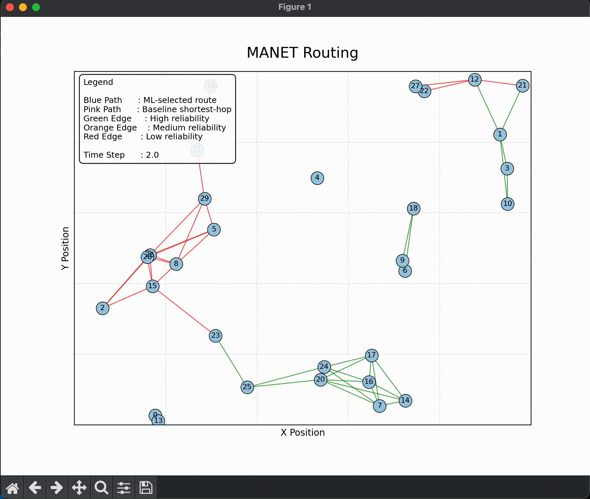
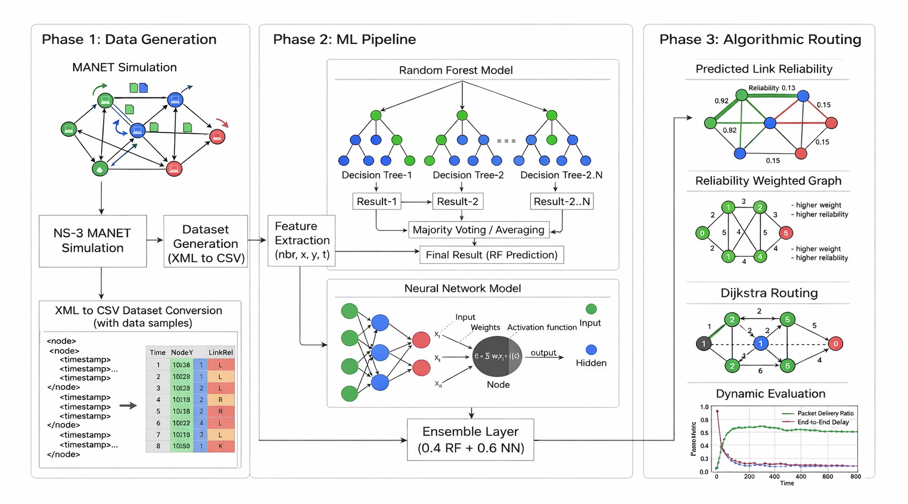
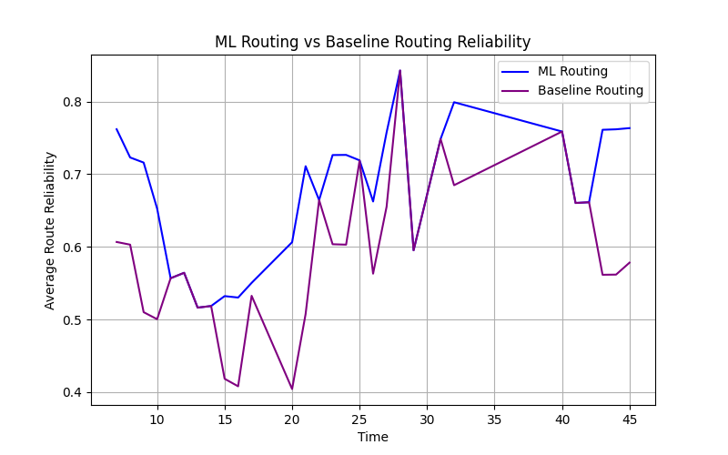

<h1 align="center">RouteCast | Reliability-Aware Routing for MANETs</h1>

<p align="center">


</p>

<p align="center">
Predicting unreliable wireless links to choose more stable routes in mobile networks.
</p>

---

## Project Overview

Mobile Ad Hoc Networks (MANETs) are wireless networks where nodes communicate without fixed infrastructure. Since the nodes keep moving, links often become weak or break over time.

Traditional shortest-path routing treats all links the same, which can lead to unstable routes and packet loss in dynamic MANETs.

RouteCast addresses this by predicting link reliability with machine learning and using those predictions to guide routing decisions.

The system combines:

- **NS-3 network simulation** to generate MANET mobility data
- **Machine learning models** to predict link reliability  
- **Reliability-weighted routing** to prefer more stable paths

This helps RouteCast choose routes that are generally **more stable** than standard shortest-path routing.
---

## Demo



<table align="center">
  <tr>
    <td valign="top">
      <div align="center"><strong>Link colors</strong></div>
      <table>
        <tr><th>Color</th><th>Meaning</th></tr>
        <tr><td>🟢</td><td>Reliable link</td></tr>
        <tr><td>🟠</td><td>Medium reliability</td></tr>
        <tr><td>🔴</td><td>Unstable link</td></tr>
      </table>
    </td>
    <td valign="top">
      <div align="center"><strong>Routing paths</strong></div>
      <table>
        <tr><th>Color</th><th>Meaning</th></tr>
        <tr><td>🔵</td><td>ML-selected route</td></tr>
        <tr><td>🟣</td><td>Baseline shortest-path route</td></tr>
      </table>
    </td>
  </tr>
</table>

---

## Architecture
Add the architecture image at `assets/architecture.png`. 



<!-- Also add: Reliability comparison plot -->



---

## Running the project

```bash
# 1. create a virtual environment
python -m venv venv
source venv/bin/activate
```

```bash
# 2. install dependencies
pip install -r requirements.txt
```

```bash
# 3. run the MANET routing animation (uses dataset/manet_dataset.csv)
python src/routing_animation.py
```

```bash
# 4. you can also explore model training and evaluation:
jupyter lab notebooks/training.ipynb
```

If you want to re-run simulations with your local ns-3:

```bash
# copy simulation to your ns-3 scratch folder (script already does this)
./scripts/run_simulations.sh
```

---

## Dataset (summary)

<!-- - ~54,000 samples from 30 runs (30 runs × 1,800 samples each)
- Features: neighbor_count, x, y, time
- Target: link_failure (binary, thresholded on lost packets) -->


| Property | Value |
|--------|--------|
| Simulation runs | 30 |
| Nodes | 30 |
| Timesteps | 60 |
| Total samples | ~54,000 |

### Features

| Feature | Description |
|------|------|
| neighbor_count | number of neighboring nodes |
| x, y | node position |
| time | simulation timestep |

### Target

| Label | Meaning |
|------|------|
| link_failure | binary indicator of link breakage |


---

## Key Contributions

- Built a full pipeline from **network simulation → dataset generation → ML model training → routing evaluation**

- Designed an **ensemble model (Random Forest + Neural Network)** to predict MANET link reliability

- Integrated ML predictions into **reliability-weighted Dijkstra routing**

- Demonstrated **~10% improvement in route reliability** over traditional shortest-path routing

- Developed a **dynamic MANET topology visualization** to compare routing strategies

---

## Results (summary)

#### Model Performance

| Metric | Value |
|------|------|
| Ensemble AUC | 0.79 |

#### Routing Performance

| Routing Metric | Baseline | ML Routing |
|------|------|------|
| Avg Route Reliability | 0.658 | **0.723** |
| Avg Hop Count | 3.75 | 3.82 |

**Reliability improvement:** ~9.8%

The ML-assisted routing consistently avoids unstable links and selects routes with higher reliability.

Detailed evaluation plots are available in:

```bash
notebooks/evaluate_routing.ipynb
```

---

## Future work

- Incorporating wireless signal features (RSSI, link duration, signal strength).
- Exploring reinforcement learning–based routing.
- Evaluating performance on larger network sizes.
- Integrating reliability prediction directly into NS-3 routing protocols.

---

## References

